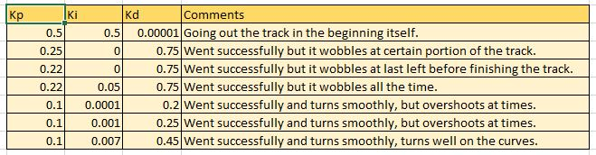

# CarND-Controls-PID
Self-Driving Car Engineer Nanodegree Program
---

## Describe the effect each of the P, I, D components had in your implementation.

1. **Propotionality Constant (Kp) :**
The Propotionality Constant is used to adjust the measurements in proportion to the error at the particular moment in time. This also makes the output go towards the set point. And a larger value will make the rise time to fall with the cost of a larger overshoot.

2. **Integral Constant (Ki) :**
The Integral Constant is used to adjust the measurements by taking sum of all the past errors. This minimizes the steady state error and reduces the oscillations before reaching the set point. It helps us in overcoming system bias.

3. **Differential Constant (Kd) :**
The Differential Constant is used to adjust the measurements by taking the change of error between time step into account. This helps to reduce the overshooting and therfore reduce the time to achieve the steady state.

## Describe how the final hyperparameters were chosen.

The final parameter were chosen by trying out various options and observing the changes based on inputs given. Combining them with my knwoledge of the PID controller, I found the final parameter that works pretty fine as expected.

The below are the combination of values that I have tried. I have added my comments along with the values tried in the picture below.

In certain cases, the controller couldn't control the car movement and the car went out of the track. I have chosen the following  values as it was able to perform really well in the curves by making it turn smoothly and is able to travel the entire track without going out of the track.

>**Kp=0.1
 Ki=0.007
 Kd=0.45**